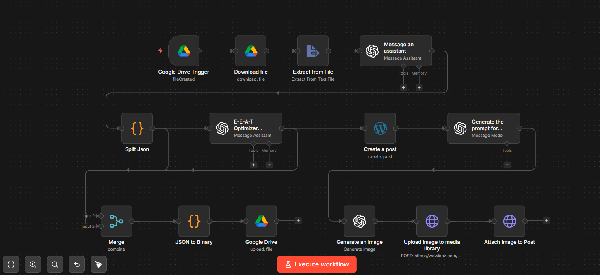
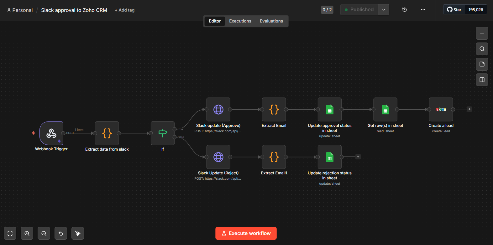
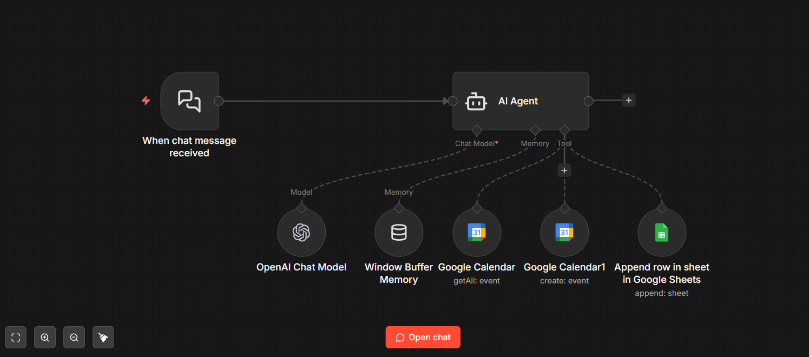
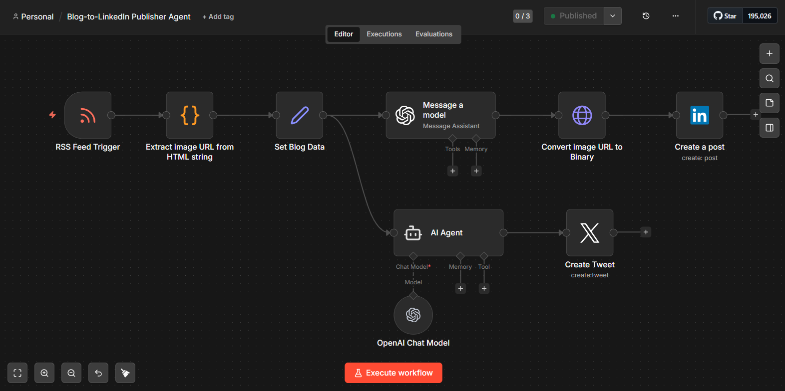
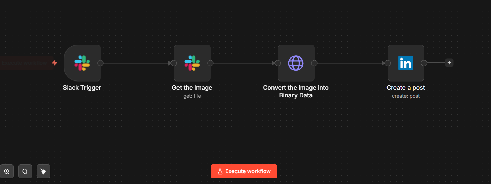
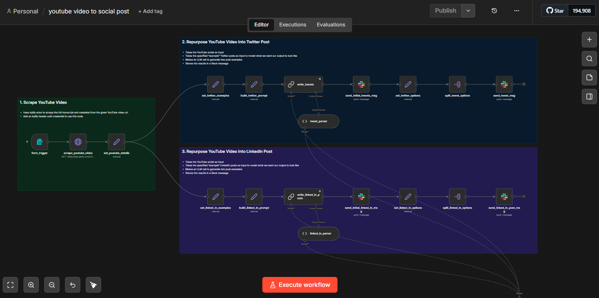

# n8n Automation Portfolio

**Sayan Sen — AI & Automation Developer**

A selection of automation workflows I've designed and built with [n8n](https://n8n.io), combining webhooks, third-party APIs, and LLM / AI-agent steps to take manual work off people's plates across content, CRM, and scheduling.

Several of these were built as production systems, so I've written them up at an architecture level and left out code, prompts, and credentials by design. The screenshots show the actual node graphs.

**Tools used across these builds:**
n8n · OpenAI & Anthropic (LLMs / AI agents) · LangChain agent tooling · Slack (Block Kit) · Zoho CRM · Google Workspace (Calendar, Sheets, Drive) · WordPress REST API · LinkedIn & X APIs · Apify · Webhooks

> Collectively these automate an estimated **~5 hrs/week** of manual work. *(fill in your figure)*

---

## 1. AI Blog Pipeline → WordPress
*Drive drop-in → AI draft → SEO / E-E-A-T pass → auto-generated feature image → published draft*

**Problem:** turning a raw topic into a publish-ready, SEO-sound article with matching artwork is slow and repetitive.

**How it works:** a topic file dropped into a watched Google Drive folder triggers the flow. The text is extracted and passed to an OpenAI assistant that drafts the article, then a second "E-E-A-T optimizer" assistant refines it for experience / expertise / authority / trust signals. The result is created as a WordPress draft via the REST API. In parallel, the pipeline generates an image prompt from the article, creates a feature image, uploads it to the WordPress media library, and attaches it to the post. A formatted copy is archived back to Drive.

**Stack:** n8n · Google Drive · OpenAI (assistants + image generation) · WordPress REST API · binary / media handling

---

## 2. Lead Intake & Approval → CRM  *(human-in-the-loop)*
*Website form → Slack approval buttons → Google Sheets → Zoho CRM*

**Problem:** new website leads needed a fast human gate before landing in the CRM, with a clear audit trail.

**How it works:** a website form posts to an n8n webhook, which logs the lead to Google Sheets (status: *Pending*) and sends an interactive Slack message (Block Kit) with **Approve** / **Reject** buttons. When a team member clicks, a second flow updates the original Slack message in place — showing the decision and who made it — updates the lead's status in Sheets, and, on approval, creates the lead in Zoho CRM.

**Stack:** n8n · Slack (interactive Block Kit) · Google Sheets · Zoho CRM · webhooks

**Highlights:** interactive approval buttons, in-place Slack message updates, a human-in-the-loop gate, and a full path through to the CRM.

---

## 3. AI Website Assistant  *(chat + scheduling)*
*A conversational agent that answers questions and books meetings*

**Problem:** website visitors wanted quick answers and an easy way to book a call without leaving the chat.

**How it works:** a chat message hits an AI agent (OpenAI) with a windowed conversation memory and a set of tools. It can read a Google Calendar to check availability, create a calendar event to book the meeting, and log the enquiry to Google Sheets. The agent gathers the visitor's name, email, and preferred time, confirms the details, and schedules the meeting — all inside the conversation.

**Stack:** n8n · LangChain AI agent · OpenAI · conversation memory · Google Calendar (as an agent tool) · Google Sheets

---

## 4. Blog → LinkedIn & X Auto-Publisher
*New post in the feed → AI-written, platform-tailored copy → published with image*

**Problem:** every new blog post meant manually writing and posting separate LinkedIn and X updates.

**How it works:** an RSS trigger fires on each new post. The flow extracts the post's image from the HTML, then uses OpenAI to write copy tuned to each platform — a caption for LinkedIn and a separate tweet for X. The image is fetched as binary and both posts are published automatically.

**Stack:** n8n · RSS · OpenAI · LinkedIn & X APIs · HTML parsing · binary handling

---

## 5. Slack → LinkedIn Image Publisher
*Drop an image in Slack → it posts to LinkedIn*

**Problem:** sharing approved visuals to LinkedIn was a manual download-and-re-upload chore.

**How it works:** mentioning the bot on a Slack message with an image triggers the flow. It retrieves the file, fetches it as binary via an authenticated request, and publishes it to LinkedIn with the caption taken from the Slack message.

**Stack:** n8n · Slack · HTTP · LinkedIn API · binary handling

---

## 6. YouTube → Social Repurposer
*Paste a video URL → get Twitter & LinkedIn drafts for review*

**Problem:** turning long videos into social posts by hand is slow.

**How it works:** a form takes a YouTube URL, an Apify actor scrapes the transcript, and LLM calls (OpenAI / Anthropic) generate platform-tailored Twitter and LinkedIn drafts using structured output parsing and example posts as style guides. Drafts are delivered to Slack for a human to review before publishing.

**Stack:** n8n · Apify · OpenAI / Anthropic · structured output parsing · Slack

---

### About
Production automation work I designed and built. Code, prompts, and credentials are intentionally omitted; the write-ups and screenshots show the architecture.

**Elsewhere:** [CardFinder (live)](https://cardfinder.ae) · [LinkedIn](https://www.linkedin.com/in/sayansendev/) · sensayan41.ss@gmail.com
